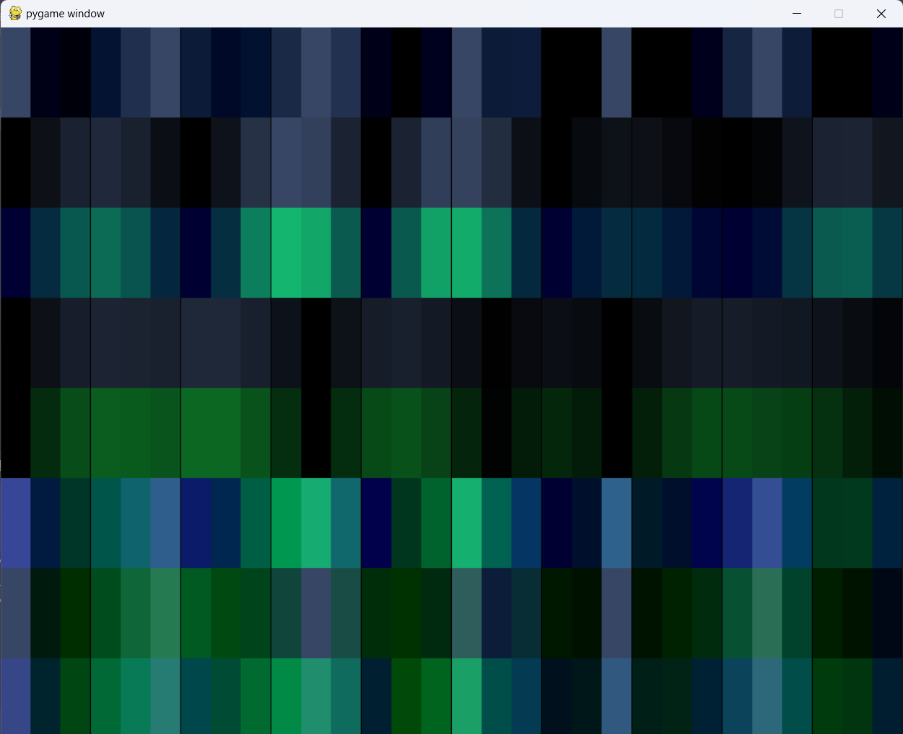

# LifxForestPath

## Overview
I have a gameroom upstairs. It is the only room upstairs. The room is being decorated (over some years) to be similar to a medival tavern. The idea is that this can be a place to hide out for a while.

I want to start to set the vibe for the gameplay upon approaching to room. To do this, the stair well is being decorated to be a path through a forest. Lighting is simulating light through a forest canopy. Visualize leaves gently fluttering, and branches swaying. This Python project is controling two LifX light strips, one on each side of the stairs. It uses 

### Credits
We use a couple of libries.

Meghan Clark Lifxlan project to control the light strips
- https://github.com/mclarkk/lifxlan

Random noise is created via perlin_noise
- https://pypi.org/project/perlin-noise/

Pygame is used for visulaization of the simulation of the masking.
- https://www.pygame.org

## Authors

## Code

### Mask Application

Top row is mask

Row 2 and 3 are narrow color change (leaves)
Negative of narrow color change to add to mask to reduce saturation (to prevent add color from over saturating the zone)
Positive of color change to add to mask to change color

Row 4 and 5 are wider color change (branches)
Negative of narrow color change to add to mask to reduce saturation (to prevent add color from over saturating the zone)
Positive of color change to add to mask to change color

Row 6 is image of leaves for reference
Row 7 is image of brances for reference

Bottom is the combinateion of leaves and branches

Control if daylight or moonlight (color pallet for changes)

Wind occurs randomly every 15 to 25 seconds and makes leaves and branches "move" twice as fast for 5 seconds.
